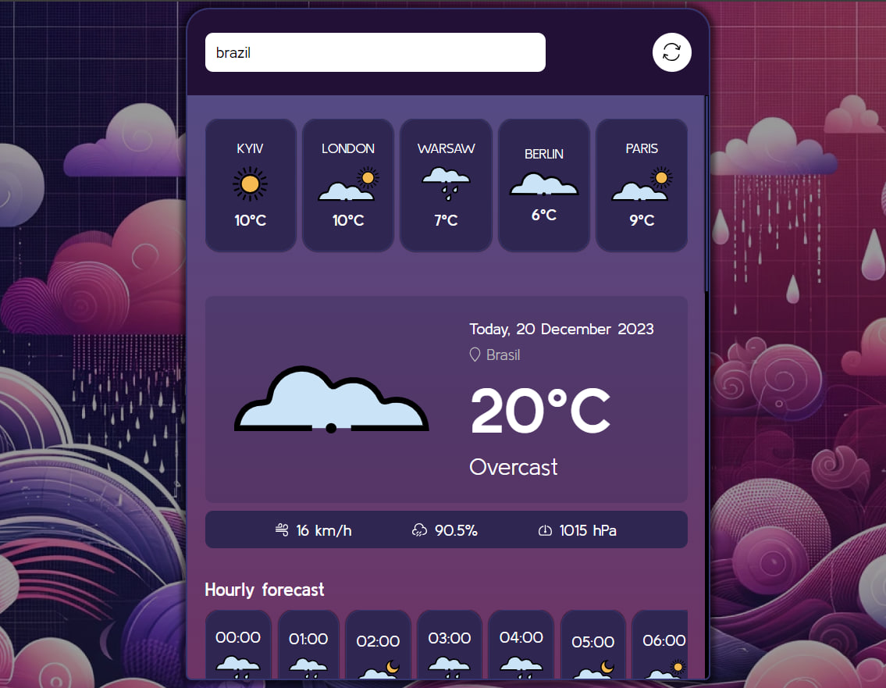

# WeatherApp - Interactive Weather Dashboard

Welcome to the WeatherApp project! This is an interactive web application that provides real-time weather data, including temperature, humidity, pressure, and wind speed.

## Features

- **Real-Time Weather Data**: Access up-to-date weather information for locations around the world.
- **Interactive Dashboard**: Engage with the weather data through a user-friendly and interactive interface.
- **Responsive Design**: Whether on desktop, tablet, or mobile, get the full experience with a responsive layout that adapts to your device.

## Technologies Used

- **HTML5**: For structuring the web application content.
- **SCSS**: For advanced styling and responsive design.
- **JavaScript**: To handle the interactivity and fetch weather data from APIs.

## Acknowledgments

- Thanks to all the open-source APIs and libraries that made this project possible.
- Appreciation for the community and contributors who provided feedback and suggestions.
[Visual Crossing](https://www.visualcrossing.com)
---

## Setup

Clone the repository and run the following command to start the development server:
[git clone https://github.com/Vergos1/project_hogwarts-parallax.git ](https://github.com/Vergos1/pet-project_weatherApp.git)

## Created by
Design and any crafted with 💜 by [Ihor Yanchuk](https://github.com/Vergos1). For more information or to view my other work, please visit [my portfolio](http://yanchuk.vinnytsia.ua/).
